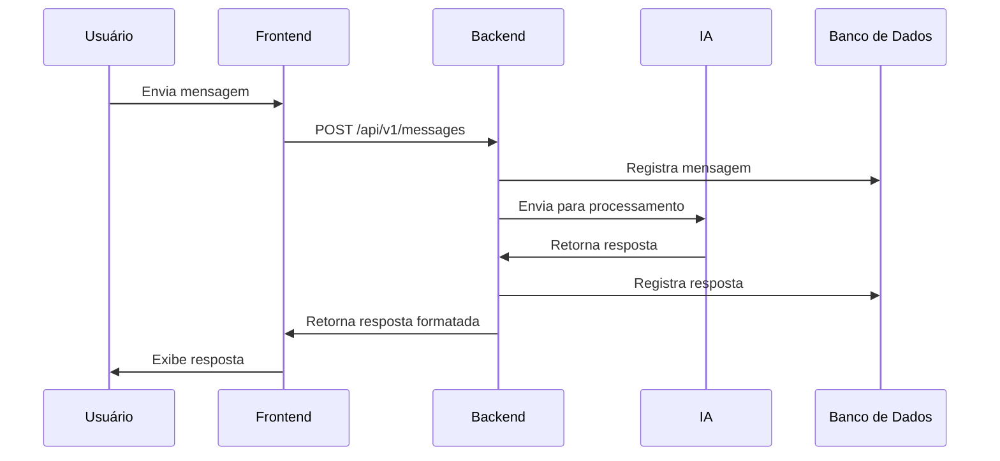

# Documentação Técnica do ChatAI

  
*Diagrama simplificado do fluxo de dados e componentes principais*

## 1. Visão Técnica do Sistema

### 1.1 Stack Tecnológica
- **Backend**: Flask 2.0.2
- **Banco de Dados**: SQLite (Desenvolvimento), PostgreSQL (Produção)
- **ORM**: SQLAlchemy 1.4
- **Processamento de Texto**: NLTK 3.6.7
- **Interface**: HTML5, Bootstrap 5.1, JavaScript ES6
- **Gerenciamento de Pacotes**: Poetry 1.2

### 1.2 Princípios de Design
- Padrão MVC (Model-View-Controller)
- Injeção de Dependência para gestão de banco de dados
- RESTful API design
- Princípios SOLID para estruturação de classes

## 2. Estrutura do Projeto (Detalhada)

```
ChatAI/
├── app.py                     # Ponto de entrada principal
├── config/
│   ├── __init__.py            # Configurações de ambiente
│   ├── settings.py            # Parâmetros de configuração
│   └── constants.py           # Constantes globais
├── backend/
│   ├── database/
│   │   ├── connectors.py      # Implementações de conexão
│   │   ├── crud.py            # Operações CRUD genéricas
│   │   └── migrations/        # Alembic migrations
│   ├── models/
│   │   ├── base.py            # Modelo base SQLAlchemy
│   │   ├── conversation.py    # Entidade Conversation
│   │   └── message.py         # Entidade Message
│   ├── routes/
│   │   ├── api/
│   │   │   └── v1/           # Versionamento de API
│   │   │       └── chats.py   # Endpoints REST
│   │   └── web.py             # Rotas web
│   ├── services/
│   │   ├── ai_processor.py    # Integração com IA
│   │   └── history_manager.py # Gestão de histórico
│   └── utils/
│       ├── decorators.py      # Decoradores customizados
│       └── validators.py      # Validação de dados
├── static/
│   ├── css/                   # Estilos customizados
│   ├── js/                    # Lógica frontend
│   └── assets/                # Imagens e recursos
├── templates/                 # Jinja2 templates
│   ├── layouts/               # Layouts base
│   └── pages/                 # Páginas específicas
├── tests/                     # Testes automatizados
├── pyproject.toml             # Configuração Poetry
└── .env.example               # Variáveis de ambiente
```

## 3. Configuração do Ambiente

### 3.1 Pré-requisitos
- Python 3.9+
- SQLite3
- Node.js (para assets build)

### 3.2 Instalação
```bash
# Clonar repositório
git clone https://github.com/seu-usuario/chat-ai.git
cd chat-ai

# Configurar ambiente virtual
python -m venv venv
source venv/bin/activate  # Linux/MacOS
venv\Scripts\activate     # Windows

# Instalar dependências
poetry install

# Configurar variáveis de ambiente
cp .env.example .env
```

### 3.3 Configuração do Banco de Dados
```python
# config/settings.py
class Config:
    SQLALCHEMY_DATABASE_URI = os.getenv('DATABASE_URL', 'sqlite:///../data/chat.db')
    SQLALCHEMY_TRACK_MODIFICATIONS = False
```

## 4. Modelos de Dados

### 4.1 Diagrama ER


### 4.2 Esquema do Banco
**Conversation**
- id: Integer (PK)
- title: String(255)
- created_at: DateTime
- updated_at: DateTime

**Message**
- id: Integer (PK)
- content: Text
- role: Enum('user','assistant')
- conversation_id: Integer (FK)
- created_at: DateTime

## 5. API Reference (v1)

### 5.1 Endpoints Principais

#### `GET /api/v1/conversations`
**Response:**
```json
{
  "data": [
    {
      "id": 1,
      "title": "Discussão sobre IA",
      "message_count": 5,
      "created_at": "2023-08-20T12:34:56Z"
    }
  ],
  "pagination": {
    "page": 1,
    "per_page": 20,
    "total_items": 1
  }
}
```

#### `POST /api/v1/conversations`
**Request:**
```json
{
  "title": "Nova Conversa",
  "initial_message": "Olá, como posso ajudar?"
}
```

#### `POST /api/v1/conversations/{id}/messages`
**Request:**
```json
{
  "content": "Explique o que é machine learning",
  "role": "user"
}
```

## 6. Fluxo de Processamento



## 7. Testes e Qualidade

### 7.1 Executando Testes
```bash
pytest tests/ --cov=backend --cov-report=html
```

### 7.2 Tipos de Testes
- **Testes Unitários**: Validação de modelos e utilitários
- **Testes de Integração**: Testes de API com requests mockados
- **Testes E2E**: Testes completos com Selenium

## 8. Deployment

### 8.1 Requisitos de Produção
- Gunicorn ou Waitress
- Reverse Proxy (Nginx)
- PostgreSQL
- Redis para cache

### 8.2 Dockerização
```dockerfile
FROM python:3.9-slim

WORKDIR /app
COPY . .
RUN pip install poetry && poetry install --no-dev

EXPOSE 5000
CMD ["poetry", "run", "gunicorn", "app:app", "-b", "0.0.0.0:5000"]
```

## 9. Segurança

### 9.1 Boas Práticas Implementadas
- Validação de entrada em todos os endpoints
- Sanitização de HTML nas mensagens
- Rate limiting (100 requests/minuto)
- Criptografia de dados sensíveis no banco

### 9.2 Melhorias Planejadas
- Implementação de OAuth2
- Adição de Web Application Firewall
- Auditoria de segurança periódica

## 10. Monitoramento

### 10.1 Métricas Chave
```python
# Exemplo de métrica com Prometheus
from prometheus_flask_exporter import PrometheusMetrics

metrics = PrometheusMetrics(app)
metrics.info('app_info', 'Application info', version='1.0.3')
```

### 10.2 Log Estruturado
```json
{
  "timestamp": "2023-08-20T12:34:56Z",
  "level": "INFO",
  "module": "database.connectors",
  "message": "Conexão estabelecida com sucesso",
  "duration_ms": 45.2,
  "conversation_id": 123
}
```

## 11. Referências e Links Úteis
- [Documentação Flask](https://flask.palletsprojects.com/)
- [Guia SQLAlchemy](https://docs.sqlalchemy.org/)
- [Políticas de Segurança](https://owasp.org/www-project-top-ten/)

---

Esta documentação oferece uma visão completa do sistema, desde a configuração inicial até considerações avançadas de produção. Para detalhes específicos de implementação, consulte os comentários no código e a documentação gerada automaticamente via Sphinx.