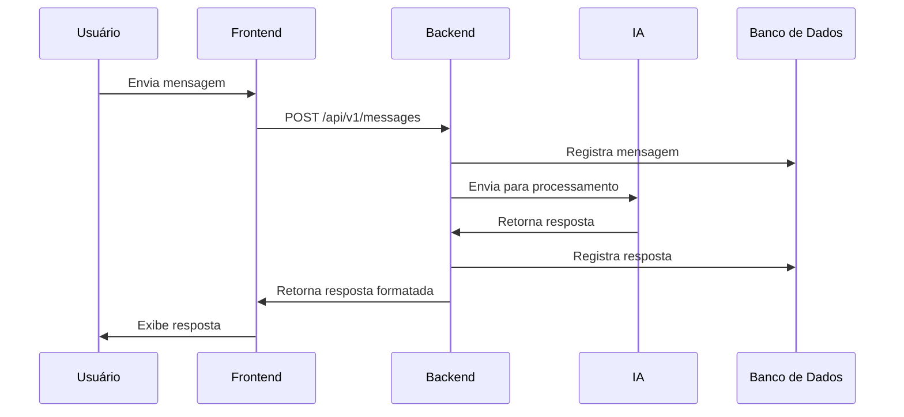

Aqui está uma versão refinada da apresentação do Projeto Guilherme, estruturada para que possa ser utilizada em qualquer contexto, seja para explicar a um humano ou a outra IA. Também incluí as fases do desenvolvimento e os próximos passos, garantindo que todas as informações estejam bem organizadas.

Projeto Guilherme – Clone de IA Conversacional Baseado em OpenWebUI
Introdução
O Projeto Guilherme é um sistema de inteligência artificial conversacional, inspirado no OpenWebUI, que tem como principal objetivo criar uma interface de chat interativa e persistente, semelhante ao ChatGPT. O foco inicial do projeto está na armazenagem do histórico de conversas utilizando um banco de dados relacional (SQLite e posteriormente PostgreSQL). No futuro, pretendemos integrar um sistema de RAG (Retrieval-Augmented Generation), que permitirá à IA recuperar informações relevantes e contextualizadas, aprimorando a qualidade das respostas.

O Projeto Guilherme está sendo desenvolvido por três agentes:

O usuário (você), que atua como arquiteto do sistema e toma decisões estratégicas.
ChatGPT (eu), auxiliando na organização, estruturação e planejamento do projeto.
IA Lovable, que analisa a estrutura do OpenWebUI e fornece insights sobre a implementação.
O desenvolvimento segue um modelo iterativo, garantindo que cada etapa esteja funcional antes de avançarmos para a próxima.

Objetivo do Projeto
O Projeto Guilherme tem como objetivo principal desenvolver uma IA conversacional independente, capaz de interagir com os usuários de forma natural, armazenar o histórico de mensagens e fornecer respostas contextualizadas utilizando técnicas avançadas de recuperação de informações.

Os principais desafios que buscamos resolver são:

Persistência de Memória: Criar um banco de dados que armazene corretamente o histórico de conversas, garantindo que ele possa ser recuperado após o recarregamento da página.
Gerenciamento Eficiente de Dados: Implementar um CRUD robusto e escalável para manter as interações do usuário.
Implementação do RAG: Utilizar um banco de dados vetorial para buscar informações relevantes e melhorar o contexto das respostas.
Escalabilidade: Construir um sistema modular e bem estruturado que possa crescer sem grandes reescritas.
Segurança e Performance: Garantir a proteção dos dados, evitar vazamentos e otimizar o desempenho do sistema.
Tecnologias Utilizadas
O projeto está sendo desenvolvido com um stack tecnológico moderno, baseado em:

Flask (Python) → Backend leve e eficiente para gerenciar as requisições e a lógica do chat.
SQLAlchemy + SQLite (futuro PostgreSQL) → Banco de dados relacional para armazenar conversas e mensagens.
JavaScript, HTML5, CSS → Construção da interface de usuário responsiva e dinâmica.
FastAPI (possível migração futura) → Melhor desempenho para lidar com requisições assíncronas.
Banco Vetorial (ChromaDB, Milvus ou PGVector - a definir) → Armazenamento de embeddings para melhorar o contexto da IA.
Estrutura do Projeto
O Projeto Guilherme segue uma estrutura modular, inspirada no OpenWebUI, para facilitar a manutenção e escalabilidade:

graphql
Copiar
Editar
Projeto Guilherme/
├── app.py                     # Aplicação principal
├── backend/
│   ├── database/
│   │   ├── __init__.py        # Torna a pasta um módulo
│   │   ├── database.py        # Gerenciamento da conexão e operações com SQLite
│   │   └── migrations/        # Scripts de migração (ex: Alembic)
│   ├── models/
│   │   ├── conversations.py   # Modelo de dados para conversas
│   │   └── messages.py        # Modelo de dados para mensagens (vinculadas às conversas)
│   ├── routers/
│   │   └── chats.py           # Endpoints REST para manipulação de conversas e mensagens
│   └── utils/
│       ├── chat_history.py    # Funções para gerenciamento do histórico de conversas
│       └── text_processor.py  # Utilitários para processamento de texto (ex: dividir mensagens longas)
└── requirements.txt           # Lista de dependências do projeto
Essa estrutura reflete a separação de responsabilidades, garantindo que cada funcionalidade tenha um módulo bem definido.

Fases do Desenvolvimento e Etapas
Estamos seguindo um planejamento em fases, garantindo que cada funcionalidade seja bem implementada antes de avançarmos para a próxima.

Fase 1: Implementação do CRUD com SQLite (Em Andamento)
✅ Criar um banco de dados para armazenar conversas e mensagens.
✅ Criar endpoints REST para manipular o histórico de conversas.
✅ Garantir que os dados sejam persistidos corretamente após o reload da página.
🔹 Configurar Alembic para gerenciar as migrações do banco de dados.
🔹 Testar e corrigir eventuais falhas no CRUD.

Fase 2: Preparação para a Migração para PostgreSQL
🔹 Configurar um ambiente PostgreSQL local para testes.
🔹 Garantir que o código esteja preparado para a migração sem precisar de grandes reescritas.
🔹 Migrar os dados do SQLite para o PostgreSQL gradualmente.

Fase 3: Implementação do RAG com Banco de Dados Vetorial
🔹 Escolher um banco de dados vetorial (ChromaDB, Milvus ou PGVector).
🔹 Criar um sistema para transformar mensagens em embeddings.
🔹 Integrar a recuperação de contexto ao fluxo da IA.
🔹 Implementar um mecanismo de busca semântica para melhorar a precisão das respostas.

Fase 4: Segurança, Performance e Testes
🔹 Implementar autenticação e controle de acessos, se necessário.
🔹 Adicionar cache para otimizar as buscas e evitar sobrecarga no banco.
🔹 Criar testes automatizados para validar o funcionamento do sistema.
🔹 Otimizar a performance para suportar múltiplas interações simultâneas.

Status Atual do Desenvolvimento
🚀 Atualmente, estamos na Fase 1 (CRUD com SQLite), e nosso foco é corrigir o problema de persistência de mensagens.

🚨 Problema Atual:

As mensagens estão sendo armazenadas temporariamente e desaparecem após o recarregamento da página.
✅ O que já foi feito:

Criamos as tabelas no SQLite.
Implementamos o sistema CRUD para salvar e recuperar conversas.
🔍 O que precisa ser corrigido:

Revisar a configuração do Alembic para garantir que as migrações estejam funcionando corretamente.
Testar se os dados estão realmente sendo persistidos no banco e corrigir falhas no carregamento das mensagens.
Conclusão e Próximos Passos
O Projeto Guilherme está sendo desenvolvido de forma estruturada e iterativa, garantindo que cada funcionalidade seja implementada corretamente antes de avançarmos para o próximo estágio.

📌 Próximo Passo Imediato:

Corrigir a persistência das mensagens no SQLite antes de iniciar a migração para PostgreSQL.
📌 Próximo Grande Passo:

Configurar um ambiente PostgreSQL para testes e preparar a transição do banco de dados.
Com esse planejamento, garantimos que o projeto evolua de forma sólida, evitando retrabalho e garantindo que cada etapa seja bem implementada. Agora, podemos continuar nossa conversa no novo chat sem perder o contexto do desenvolvimento! 🚀

# Documentação Técnica do ChatAI

  
*Diagrama simplificado do fluxo de dados e componentes principais*

## 1. Visão Técnica do Sistema

### 1.1 Stack Tecnológica
- **Backend**: Flask 2.0.2
- **Banco de Dados**: SQLite (Desenvolvimento), PostgreSQL (Produção)
- **ORM**: SQLAlchemy 1.4
- **Processamento de Texto**: NLTK 3.6.7
- **Interface**: HTML5, Bootstrap 5.1, JavaScript ES6
- **Gerenciamento de Pacotes**: Poetry 1.2

### 1.2 Princípios de Design
- Padrão MVC (Model-View-Controller)
- Injeção de Dependência para gestão de banco de dados
- RESTful API design
- Princípios SOLID para estruturação de classes

## 2. Estrutura do Projeto (Detalhada)

```
ChatAI/
├── app.py                     # Ponto de entrada principal
├── config/
│   ├── __init__.py            # Configurações de ambiente
│   ├── settings.py            # Parâmetros de configuração
│   └── constants.py           # Constantes globais
├── backend/
│   ├── database/
│   │   ├── connectors.py      # Implementações de conexão
│   │   ├── crud.py            # Operações CRUD genéricas
│   │   └── migrations/        # Alembic migrations
│   ├── models/
│   │   ├── base.py            # Modelo base SQLAlchemy
│   │   ├── conversation.py    # Entidade Conversation
│   │   └── message.py         # Entidade Message
│   ├── routes/
│   │   ├── api/
│   │   │   └── v1/           # Versionamento de API
│   │   │       └── chats.py   # Endpoints REST
│   │   └── web.py             # Rotas web
│   ├── services/
│   │   ├── ai_processor.py    # Integração com IA
│   │   └── history_manager.py # Gestão de histórico
│   └── utils/
│       ├── decorators.py      # Decoradores customizados
│       └── validators.py      # Validação de dados
├── static/
│   ├── css/                   # Estilos customizados
│   ├── js/                    # Lógica frontend
│   └── assets/                # Imagens e recursos
├── templates/                 # Jinja2 templates
│   ├── layouts/               # Layouts base
│   └── pages/                 # Páginas específicas
├── tests/                     # Testes automatizados
├── pyproject.toml             # Configuração Poetry
└── .env.example               # Variáveis de ambiente
```

## 3. Configuração do Ambiente

### 3.1 Pré-requisitos
- Python 3.9+
- SQLite3
- Node.js (para assets build)

### 3.2 Instalação
```bash
# Clonar repositório
git clone https://github.com/seu-usuario/chat-ai.git
cd chat-ai

# Configurar ambiente virtual
python -m venv venv
source venv/bin/activate  # Linux/MacOS
venv\Scripts\activate     # Windows

# Instalar dependências
poetry install

# Configurar variáveis de ambiente
cp .env.example .env
```

### 3.3 Configuração do Banco de Dados
```python
# config/settings.py
class Config:
    SQLALCHEMY_DATABASE_URI = os.getenv('DATABASE_URL', 'sqlite:///../data/chat.db')
    SQLALCHEMY_TRACK_MODIFICATIONS = False
```

## 4. Modelos de Dados

### 4.1 Diagrama ER


### 4.2 Esquema do Banco
**Conversation**
- id: Integer (PK)
- title: String(255)
- created_at: DateTime
- updated_at: DateTime

**Message**
- id: Integer (PK)
- content: Text
- role: Enum('user','assistant')
- conversation_id: Integer (FK)
- created_at: DateTime

## 5. API Reference (v1)

### 5.1 Endpoints Principais

#### `GET /api/v1/conversations`
**Response:**
```json
{
  "data": [
    {
      "id": 1,
      "title": "Discussão sobre IA",
      "message_count": 5,
      "created_at": "2023-08-20T12:34:56Z"
    }
  ],
  "pagination": {
    "page": 1,
    "per_page": 20,
    "total_items": 1
  }
}
```

#### `POST /api/v1/conversations`
**Request:**
```json
{
  "title": "Nova Conversa",
  "initial_message": "Olá, como posso ajudar?"
}
```

#### `POST /api/v1/conversations/{id}/messages`
**Request:**
```json
{
  "content": "Explique o que é machine learning",
  "role": "user"
}
```

## 6. Fluxo de Processamento



## 7. Testes e Qualidade

### 7.1 Executando Testes
```bash
pytest tests/ --cov=backend --cov-report=html
```

### 7.2 Tipos de Testes
- **Testes Unitários**: Validação de modelos e utilitários
- **Testes de Integração**: Testes de API com requests mockados
- **Testes E2E**: Testes completos com Selenium

## 8. Deployment

### 8.1 Requisitos de Produção
- Gunicorn ou Waitress
- Reverse Proxy (Nginx)
- PostgreSQL
- Redis para cache

### 8.2 Dockerização
```dockerfile
FROM python:3.9-slim

WORKDIR /app
COPY . .
RUN pip install poetry && poetry install --no-dev

EXPOSE 5000
CMD ["poetry", "run", "gunicorn", "app:app", "-b", "0.0.0.0:5000"]
```

## 9. Segurança

### 9.1 Boas Práticas Implementadas
- Validação de entrada em todos os endpoints
- Sanitização de HTML nas mensagens
- Rate limiting (100 requests/minuto)
- Criptografia de dados sensíveis no banco

### 9.2 Melhorias Planejadas
- Implementação de OAuth2
- Adição de Web Application Firewall
- Auditoria de segurança periódica

## 10. Monitoramento

### 10.1 Métricas Chave
```python
# Exemplo de métrica com Prometheus
from prometheus_flask_exporter import PrometheusMetrics

metrics = PrometheusMetrics(app)
metrics.info('app_info', 'Application info', version='1.0.3')
```

### 10.2 Log Estruturado
```json
{
  "timestamp": "2023-08-20T12:34:56Z",
  "level": "INFO",
  "module": "database.connectors",
  "message": "Conexão estabelecida com sucesso",
  "duration_ms": 45.2,
  "conversation_id": 123
}
```

## 11. Referências e Links Úteis
- [Documentação Flask](https://flask.palletsprojects.com/)
- [Guia SQLAlchemy](https://docs.sqlalchemy.org/)
- [Políticas de Segurança](https://owasp.org/www-project-top-ten/)

---

Esta documentação oferece uma visão completa do sistema, desde a configuração inicial até considerações avançadas de produção. Para detalhes específicos de implementação, consulte os comentários no código e a documentação gerada automaticamente via Sphinx.